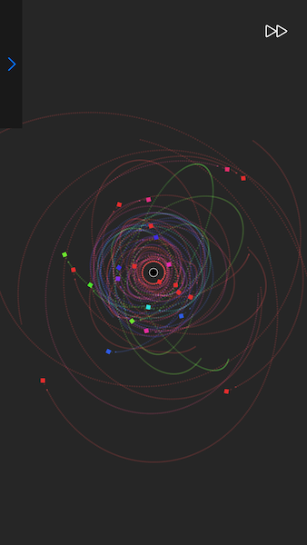
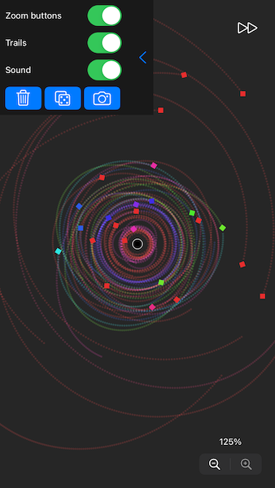
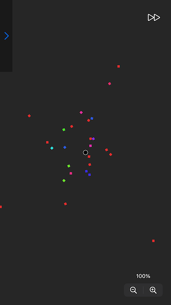

# Gravity Zen

This is an iOS app build with SpriteKit. It shows a gravitationals field and lets the user add objects. It kind of feels like meditation to add objects and watch them move and follow their trails.

## Screenshots

## Licence

MIT
